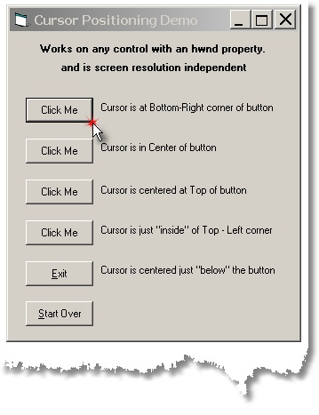

<div align="center">

## Mouse Cursor Positioning


</div>

### Description

Positions the Mousecursor over a control. Similar to other routine(s) which move the cursor to the control with the Focus. However, this method is much simpler and is resolution independent, so it doesn't need tweaking at different resolutions.
 
### More Info
 


<span>             |<span>
---                |---
**Submitted On**   |2002-04-03 13:21:16
**By**             |[Clayton Parman](https://github.com/Planet-Source-Code/PSCIndex/blob/master/ByAuthor/clayton-parman.md)
**Level**          |Intermediate
**User Rating**    |4.3 (13 globes from 3 users)
**Compatibility**  |VB 6\.0
**Category**       |[Miscellaneous](https://github.com/Planet-Source-Code/PSCIndex/blob/master/ByCategory/miscellaneous__1-1.md)
**World**          |[Visual Basic](https://github.com/Planet-Source-Code/PSCIndex/blob/master/ByWorld/visual-basic.md)
**Archive File**   |[Positionin68366432002\.zip](https://github.com/Planet-Source-Code/clayton-parman-mouse-cursor-positioning__1-33394/archive/master.zip)

### API Declarations

```
GetWindowRect
SetCursorPos
```


